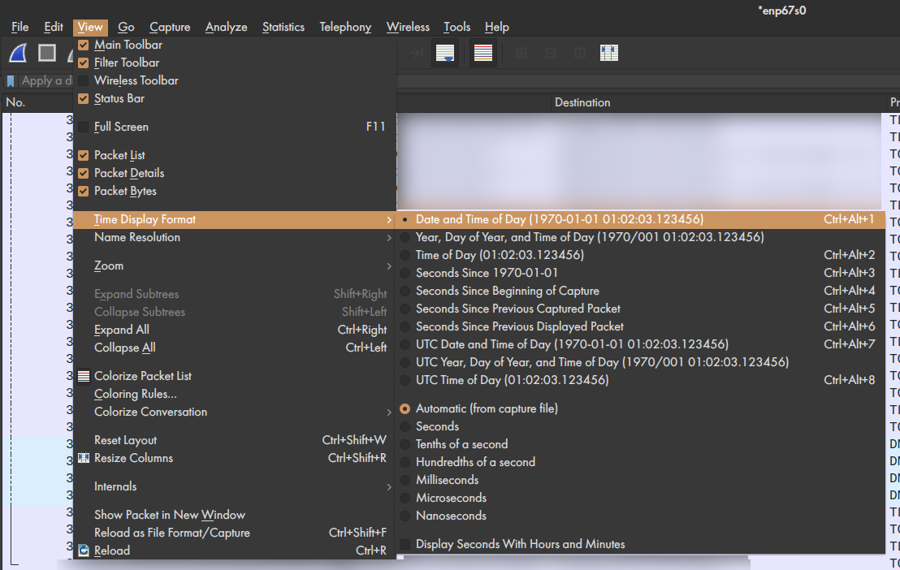

# Carbonara
## Introduction
This collection of scripts is supposed to get you some good data on how much traffic and hence CO2 you cause (YES, YOU!).
It was inspired by the Firefox addon [Carbonalyser](https://theshiftproject.org/en/carbonalyser-browser-extension/) ([on GitHub](https://github.com/carbonalyser/Carbonalyser)) and is based on their methodology with the exception that I'm not 
taking the power consumption of the device into account.
  
PS: I can do puns too!

## Methodology
Under Construction. But you can take a look in the [calc.txt](calc.txt)

## Download and Install Wireshark
[www.wireshark.org](https://www.wireshark.org/#download)

## Setup Wireshark Capture
Let Wireshark create a new file after a certain amount of time. Otherwise the files will be too big.
You have to set this up every time Wireshark is opened (e.g. after you restarted your computer).
 

**VERY IMPORTANT! Set the correct time format. This setting will be saved.** 

## Potential FritzBox Alternative
In case your router is an AVM FritzBox (not 64-Series) you can also directly capture from there with the advantage
that you also get WLAN-Traffic. 
**!!! If you are not the only client, make sure that all clients agree or otherwise just leave it.** 
This hasn't been tested on large scale captures as it is intended as a debug utility. It might not work.
You will also get files which can be opened in Wireshark.
[FritzBox Capture Page](http://fritz.box/html/capture.html)

## Export CSV 

 
Please make sure to you use leading 0s in your file naming.  
Wrong:  file_1.csv 
Right:  file_01.csv 
Otherwise the order will be messed up later on.

## Setup Python 3.x
[www.python.org](https://www.python.org/downloads/) 
**When you start the installer make sure to check the box that says "Add Python 3.x to PATH"**  

I advise you to use something like [VSCode](https://code.visualstudio.com/) because you also open your 
csv files in it easily (especially when they are larger which Excel doesn't do; Excel has a limit of 2^20 ~1 million rows)
But you can also execute it from the Python IDLE (just search for it in your start menu). Double-Clicking on the scripts
won't work as you also need to change some lines as you will see further on.

## Filtering
[Carbonara-Filter.py](Carbonara-Filter.py) 
Here we filter out all local network traffic and other undesired stuff. 
Additionally the Source and Destination Columns are merged into one and an in- or outgoing (i/o) column is added.
You need to adjust the following lines:
<pre>
l.4  | path="<b>D:/this/is/my/path/</b>" #(Do not forget the last <b>/</b>) 
l.14 | if <b>row[3]!="Remove this" and </b>row[3]!="Broadcast" and row[3]!="239.255.102.18" and \ 
l.20 | if row[2]=="<b>My Local Host Name</b>":
l.23 | elif row[3]=="<b>My Local Host Name</b>":</pre>
row[2]: Source 
row[3]: Destination 
row[4]: Protocol 

If you are on Windows also:
<pre>l.11 | with open(path+filename, "rt"<b>, newline=''</b>) as inp, open(path+"tmp/"+filename, "wt") as out:</pre>

## Removing CSV Headers
[Carbonara-CSVrmvHeaders.sh](Carbonara-CSVrmvHeaders.sh) 
If you are on a Unix-System (macOS or Linux) you are in luck because this doesn't run on Windows (you can try ubash -c "script" in command line but this has resulted in nothing but errors yet). But you can also do it manually.

## Merging CSV
[Carbonara-MergeCSV.sh](Carbonara-MergeCSV.sh) 
Same applies here. At the moment you have to find your own way to do this on Windows.

## Replacing Hosts (Round One)
[Carbonara-ReplaceHosts.py](Carbonara-ReplaceHosts.py) 
Now we will do the first round of replacing those unreadable hosts with the proper name of the service.
This must be done because e.g. Netflix or YouTube have many different servers.
The provided hosts.csv will be used at first. There is no guarantee for this to be 100% correct. Loads of services use 
use Content Delivery Networks like Akamaiedge or Cloudfront which makes it often hard or just impossible to decypher those
because some different services also might use the same server.

You need to change the file path again:
<pre>
l.3  | path="<b>D:/this/is/my/path/</b>" #(Do not forget the last <b>/</b>) </pre>

If you created your own hosts file already change the following:
<pre>
l.5  | filenameH="<b>myHosts.csv</b>"</pre>

And if you are on Windows:
<pre>
l.7  | arr=csv.reader(open(path+filename1,"rt"<b>, newline=''</b>))
l.15 | arr=csv.reader(open(path+filename,"rt"<b>, newline=''</b>))</pre>

## Top 200 Destinations
[Carbonara-Statistics.py](Carbonara-Statistics.py)
In this step you will get the 200 domains with which you communicated. This way you can find more domains which you
might want to replace in a new hosts file.

PS: I wanted to add some more statistics here - hence the name - but decided one can do it with more flexability in Excel later on.

You need to change the file path again:
<pre>
l.3  | path="<b>D:/this/is/my/path/</b>" #(Do not forget the last <b>/</b>) </pre>

If you are on Windows also:
<pre>l.6  | with open(path+filename, "rt"<b>, newline=''</b>) as inp, open(path+"tmp/"+filename, "wt") as out:</pre>

## OK. Now What?
Well, you have to find out which of the remaining weird domains belong to which service you used.
You can use your memory and browser history for that. Or have a look in the rabbit hole that is a Wireshark Capture file
to find out what you were doing and which service you can identify might have sent something before domain x.
Good luck, Watson!
From that point you can build up your own hosts file. You could create a normal textfile (in Editor, Notepadd++, etc.) and
save it as a .csv. Excel csv can sometimes cause trouble but if you try it, make sure to you the comma as a deliminator.
So it should have the format:
<pre>
Netflix,ipv4-c025-ber001-ix.1.oca.nflxvideo.net
Netflix,occ-0-1555-1556.1.nflxso.net
YouTube,r1.sn-uxaxjva0hc0n-nm4s.googlevideo.com
YouTube,r5.sn-uxaxjva0hc0n-nm4l.googlevideo.com
</pre>

## Summary
[Carbonara-Summary.py](Carbonara-Summary.py) 
Now we can finally make something usable! This summarizes all the data into time frames (default are 10 minutes)
and calculates the Top 9 domains plus the rest (domain, traffic in MiB and CO2 in mg). From that point on you can do
more statistics and evaluation of the data in Excel or another program of your liking.
In this step it might also get apparent which domains might need to be summed up (/additions to the hosts file). That means
this isn't necessarily the last step of our journey but you might want to go back to Replacing Hosts for some more rounds.

You know the drill by now:
<pre>
l.3  | path="<b>D:/this/is/my/path/</b>" #(Do not forget the last <b>/</b>) </pre>

Adjust the start and end time you want to evaluate to your needs:
<pre>
l.7  | start="2020-04-07 20:00"
l.8  | end="2020-04-14 20:00"</pre>

If you want to adjust the time frame (not tested):
<pre>
l.73 | if mc%<b>minutes</b>==0:
</pre>

If you are on Windows also:
<pre>l.31 | reader=csv.reader(open(path+filename, "rt"<b>, newline=''</b>))</pre>

PS: Evaluation over the changing of the months is currently not supported.
PPS: If you stopped the capturing (e.g. turning your computer off) it will at the moment result into row being filled with 0 where there is no data. It was not really intended (because I didn't need to deal with that) but there are also some advantages to it. I might add an option in the future none the less.
